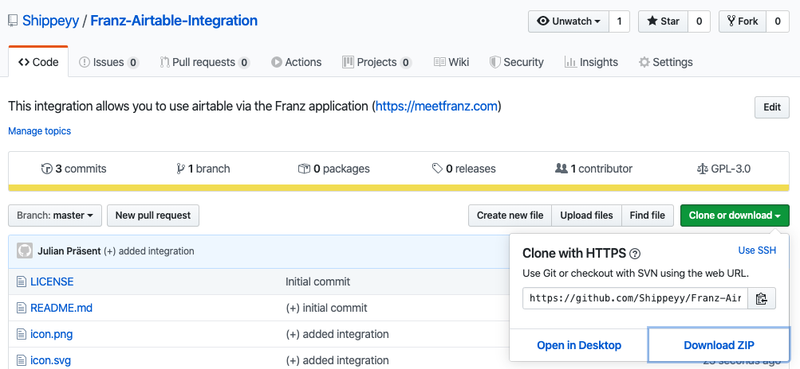

# Franz-Airtable-Integration

  
  

This integration allows you to use airtable via the [Franz application](https://meetfranz.com)

## Prerequisites

- Franz v5.x (or higher)

can be installed via [Franz](https://meetfranz.com/)

## Installation / Usage

1. download the repository as a zip file via the github ui:

2. create the Franz dev folder (if it doesn´t exist already) in the following directory

- Mac: ~/Library/Application Support/Franz/recipes/dev/
- Windows: %appdata%/Franz/recipes/dev/
- Linux: ~/.config/Franz/recipes/dev

3. copy the extracted zip file to the dev folder
4. restart Franz
5. navigate to Settings -> Available Services -> Custom Services and click on the airtable logo on the bottom

## Contributing

Pullrequests, issues and feature requests are welcome. Feel free to check the issues page if you want to contribute.

Please use [git-flow](https://danielkummer.github.io/git-flow-cheatsheet/) for a clean version control, use [keepachangelog](https://keepachangelog.com/en/1.0.0/) and make pullrequests instead of merging directly to develop. Make sure that your code is documented and maintainable (keep future extensions in mind).

## Authors

👤 **Julian Präsent**

- Github: [@Shippeyy](https://github.com/Shippeyy)

## 📝 License

Copyright © 2019 [Julian Präsent](https://github.com/Shippeyy).
This project is [GNU General Public License v3.0](https://www.gnu.org/licenses/gpl-3.0.de.html) licensed.
